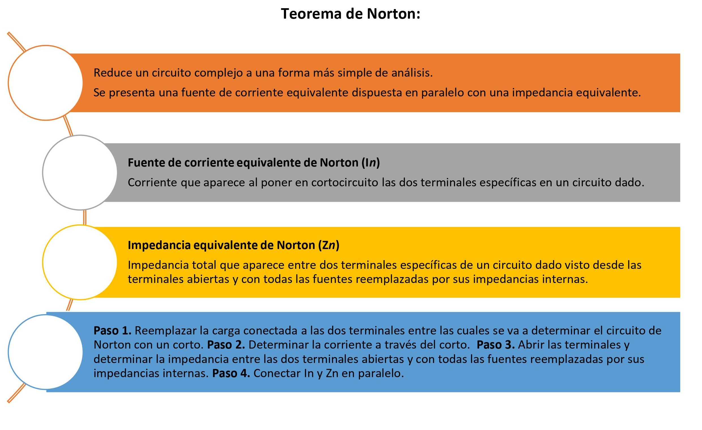
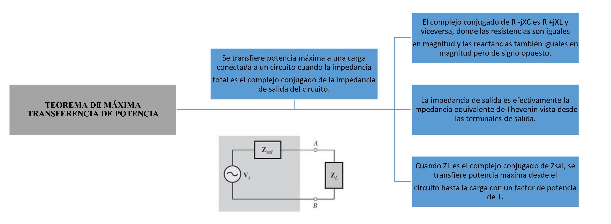
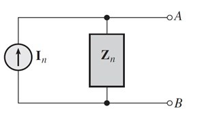
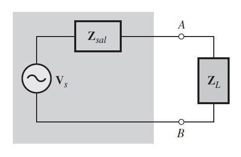

# Producto Unidad 2
1. OBJETIVOS

• Analizar el teorema de superposición y aplicarlo en circuitos con corriente alterna.

• Conocer las equivalencias de la fuente de voltaje y corriente al aplicar el teorema de superposición.

• Comprobar de forma practica el teorema de Thevenin
 
•	Realizar un circuito equivalente para el ejemplo dado, poniendo en práctica lo aprendido anteriormente y sobretodo generando nuevos conocimientos

• 

•	

2. MARCO TEÓRICO

*Teorema de superposición:*

*Teorema de Thevenin:*

*Teorema de Norton:*

*Teorema de Máxima transferencia de Potencia:*

3. DIAGRAMAS:

*Teorema de superposición:*

*Teorema de Thevenin:*

*Teorema de Norton:*

*Teorema de Máxima transferencia de Potencia:*

4. EXPLICACIÓN

5. CONCLUSIONES

•El uso y aplicación del teorema de superposición es de gran efectividad cuando tenemos más de dos fuentes de voltaje (o corriente) presentes en nuestro circuito electrónico y queremos calcular la intensidad que fluye en algún elemento en específico. En circuitos complejos no resulta práctico el uso de este método, por ejemplo, al realizar cálculos por separado en un circuito estimulado con corrientes directa y alterna a la vez, como son los circuitos con elementos activos (transistores, circuitos operacionales, etc.), así como los estimulados con señales no sinusoidales.

•	El circuito obtenido tras aplicar el teorema de Thévenin es mucho más sencillo y rápido para calcular el voltaje y la corriente cuando la carga está conectada, o la potencia que se puede transferir al circuito.

•	Este teorema se puede aplicar a cualquier elemento del circuito, siempre que la red tenga al menos una fuente independiente.

•	Nos permite encontrar circuitos equivalentes en circuitos complejos de una forma sencilla y rápida. 

6. BIBLIOGRAFÍA

•	Floyd Thomas L, “Principios de Circuitos Eléctricos”, 8 ed. 2007 .Pearson Educación de México, S.A. de C.V. México, pp. 281-333.

• 

• 
