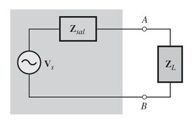

# Producto Unidad 2
1. OBJETIVOS

• Recopilar de una manera eficaz y breve una serie de teoremas de circuitos en los cuales se aplica la corriente alterna. Analizar diferentes tipos de circuitos calculando intensidades, tenciones y potencias. Establecer y definir aquellos teoremas que nos facilitaran a la hora de obtener datos que se nos presenta en un problema.  

• Analizar el teorema de superposición y aplicarlo en circuitos con corriente alterna.

• Conocer las equivalencias de la fuente de voltaje y corriente al aplicar el teorema de superposición.

• Comprobar de forma practica el teorema de Thevenin
 
•	Realizar un circuito equivalente para el ejemplo dado, poniendo en práctica lo aprendido anteriormente y sobretodo generando nuevos conocimientos

•	Establecer que cualquier circuito lineal se puede sustituir por una fuente equivalente de corriente en paralelo con una impedancia equivalente. Al sustituir un generador de corriente por uno de tensión. 

• Determinar el valor de impedancia de la carga con el cual se transfiere potencia máxima desde un circuito dado

2. MARCO TEÓRICO

*Teorema de superposición:*

*Teorema de Thevenin:*

*Teorema de Norton:*

*Teorema de Máxima transferencia de Potencia:*

3. DIAGRAMAS:

*Teorema de superposición:*

*Teorema de Thevenin:*

*Teorema de Norton:*

*Teorema de Máxima transferencia de Potencia:*

4. EXPLICACIÓN:

5. CONCLUSIONES

•El uso y aplicación del teorema de superposición es de gran efectividad cuando tenemos más de dos fuentes de voltaje (o corriente) presentes en nuestro circuito electrónico y queremos calcular la intensidad que fluye en algún elemento en específico. En circuitos complejos no resulta práctico el uso de este método, por ejemplo, al realizar cálculos por separado en un circuito estimulado con corrientes directa y alterna a la vez, como son los circuitos con elementos activos (transistores, circuitos operacionales, etc.), así como los estimulados con señales no sinusoidales.

•	El circuito obtenido tras aplicar el teorema de Thévenin es mucho más sencillo y rápido para calcular el voltaje y la corriente cuando la carga está conectada, o la potencia que se puede transferir al circuito.

•	Este teorema se puede aplicar a cualquier elemento del circuito, siempre que la red tenga al menos una fuente independiente.

•	Nos permite encontrar circuitos equivalentes en circuitos complejos de una forma sencilla y rápida.

•		El teorema de Norton proporciona un método para reducir cualquier circuito de ca a una forma equivalente compuesta de una fuente de corriente equivalente dispuesta en paralelo con una impedancia equivalente.

• Se transfiere potencia máxima a una carga cuando la impedancia de carga es el complejo conjugado de
la impedancia del circuito de control.

6. BIBLIOGRAFÍA

•	Floyd Thomas L, “Principios de Circuitos Eléctricos”, 8 ed. 2007 .Pearson Educación de México, S.A. de C.V. México, pp. 281-333.

• Calvo-Rolle, J. L. (2004). Teoremas de Thevenin y Norton con OrCad. Revista española de electrónica, (601), 48-49.

• Johnson, D. E., Hilburn, J. L., Johnson, J. R., & Pozo, V. G. (1987). Análisis básico de circuitos eléctricos. Prentice-Hall Hispanoamericana.

• Macías García, M. E., Contreras Hinojosa, C., Anaya Zamora, R., García, M. E. M., Hinojosa, C. C., & Zamora, R. A. Circuitos eléctricos de corriente alterna.

